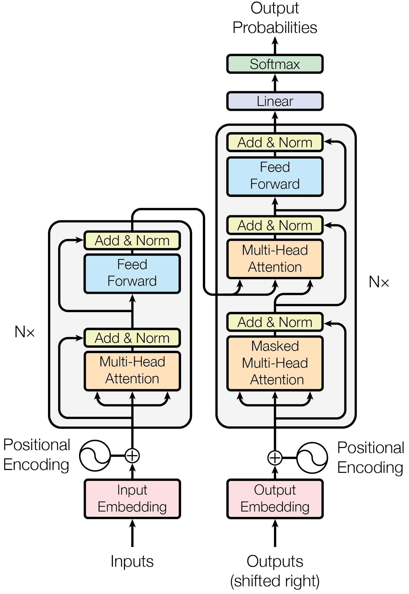
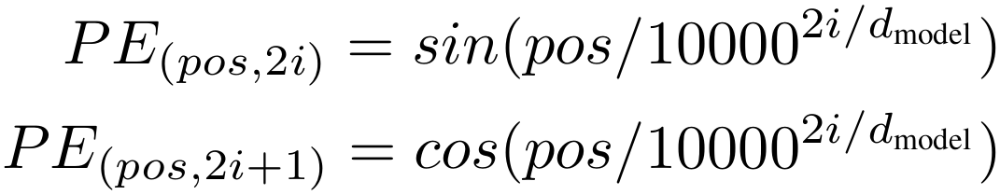
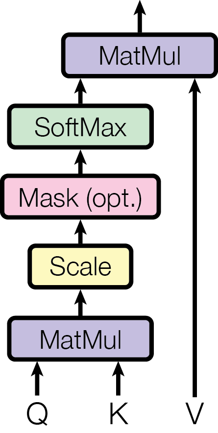
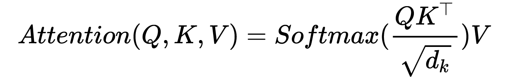
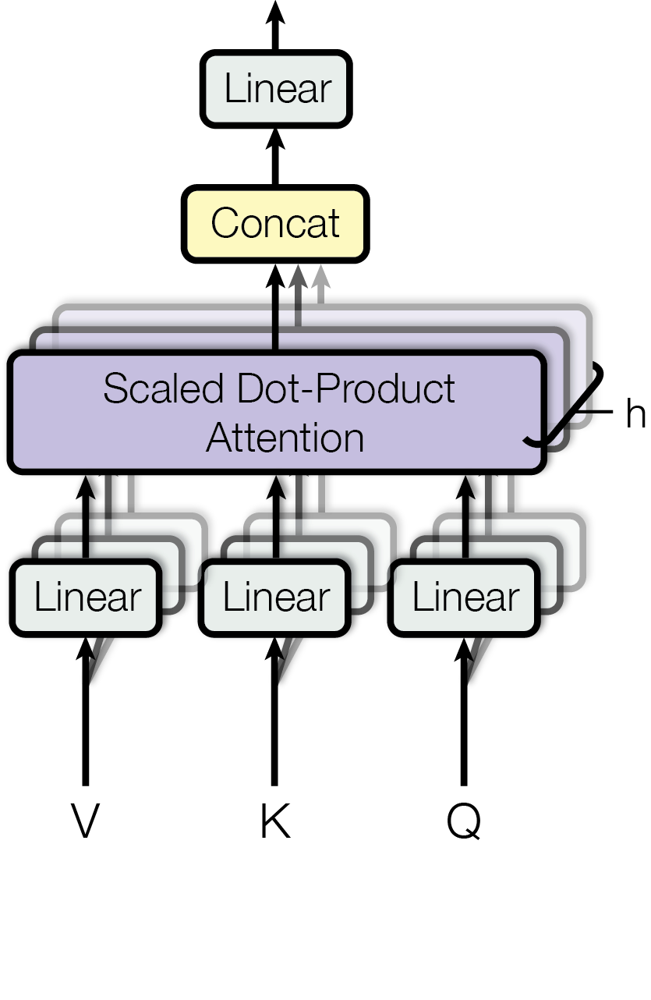
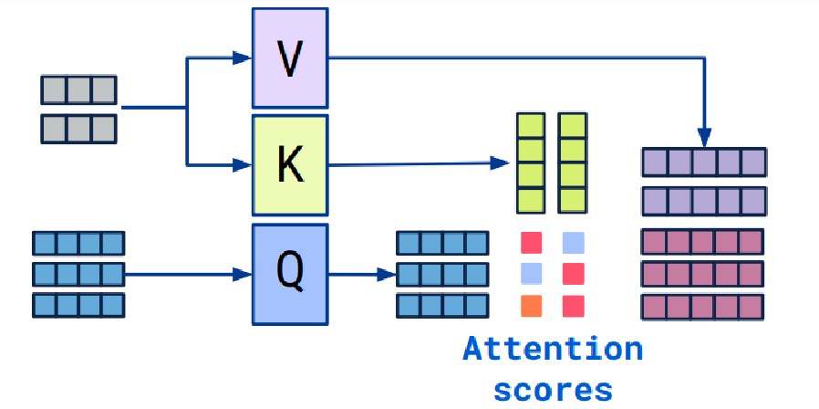
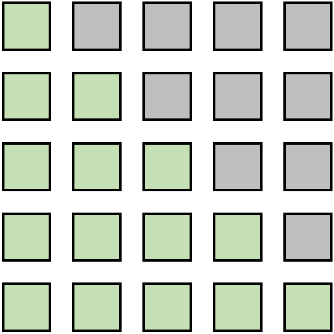
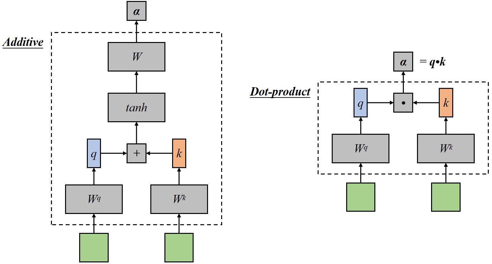
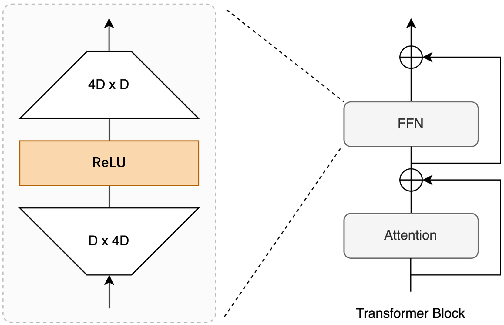

# Transformer-interview
Transformer面试常见八股
# Transformer


## Positional Encoding
由于自注意力机制是对所有输入元素进行加权求和，它无法区分序列中元素的顺序。因此需要位置编码来为输入序列中的每个位置添加位置信息
### 位置编码的形式
在论文中，位置编码使用正弦和余弦函数来生成，是一个与词嵌入维度相同的向量：

- pos是序列中的位置（从0开始）
- i是维度索引（从0开始）
- dmodel​是词嵌入的维度
### 其他位置编码方式
可学习的位置编码、相对位置编码、旋转位置编码（RoPE）

## Attention

1. 输入：x维度为[batch_size, seq_length, embed_dim]
2. 线性投影：将输入x，分别乘以w_q, w_k, w_v，生成Q、K、V
其中，w的维度都是 [batch_size, embed_dim, embed_dim]
Q, K, V的维度都是 [batch_size, seq_length, embed_dim]
3. 计算注意力：


## Multi-Head Attention


和单头的区别：
使用多组不同的线性投影（权重矩阵），将输入x投影到多个不同的子空间中。
每个头都有自己的QKV
1. 输入：x维度为[batch_size, seq_length, embed_dim]
还需要输入头的个数 h
2. 线性投影：将输入x，对于第 H_i 个头，乘以w_q^i, w_k^i, w_v^i，生成Q_i、K_i、V_i
其中，w的维度都是 [batch_size, embed_dim, d_k]
d_k = embed_dim // h (head头数) d_k是子空间的维度
Q_i, K_i, V_i的维度都是 [batch_size, seq_length, d_k]
3. 分别计算每个头的注意力
4. concat还原维度，做线性投影
```python
class MultiHeadAttention(nn.Module):
    def __init__(self, hidden_dim, nums_head) -> None:
        super().__init__()
        self.nums_head = nums_head
        
        self.head_dim = hidden_dim // nums_head
        self.hidden_dim = hidden_dim

        self.q_proj = nn.Linear(hidden_dim, hidden_dim)
        self.k_proj = nn.Linear(hidden_dim, hidden_dim)
        self.v_proj = nn.Linear(hidden_dim, hidden_dim)
        self.o_proj = nn.Linear(hidden_dim, hidden_dim)

    def forward(self, x):
        batch_size, seq_len, _ = x.size()

        Q = self.q_proj(x)
        K = self.k_proj(x)
        V = self.v_proj(x)

        q_state=Q.view(batch_size,seq_len,self.nums_head, self.head_dim).permute(0, 2, 1, 3)
        k_state=K.view(batch_size,seq_len,self.nums_head, self.head_dim).transpose(1, 2)
        v_state=V.view(batch_size,seq_len,self.nums_head, self.head_dim).transpose(1, 2)

        # MatMul and Scale
        attention_weight = (
            q_state@k_state.transpose(-1, -2) / math.sqrt(self.hidden_dim)
            )
        
        # Mask (opt.)
        if attention_mask is not None:
            attention_weight=attention_weight.masked_fill(attention_mask == 0, float("-1e20"))

        # Softmax
        attention_weight = torch.softmax(attention_weight, dim=-1)
        
        output_mid = attention_weight @ v_state
        output_mid = output_mid.transpose(1, 2).contiguous()

        output = output_mid.view(batch_size, seq_len, -1)
        output = self.o_proj(output)
        return output
```

## 为什么Q、K、V 相同
自注意力机制中，Q、K、V都是从同一个输入序列x中生成的，是因为：
- 自注意力 的目标是捕捉输入序列中元素之间的依赖关系，因此需要让每个元素同时作为Query、Key和Value
- 通过这种方式，模型可以计算每个元素与其他元素之间的关系，并生成上下文相关的表示


## Cross Attention

在Decoder的 交叉注意力机制（Cross-Attention） 中，Q、K、V 的来源不同：
- Query (Q)：来自 Decoder 的输入（目标序列）
- Key(K)和Value(V)：来自 Encoder 的输出（源序列的上下文表示）
这种设计使得 Decoder 能够根据 Encoder 的输出生成目标序列

## Decoder的MHA为什么要做Mask


使用Mask主要是为了防止信息泄露
- 防止信息泄露
    - 自回归生成：在生成任务中，Decoder需要逐个生成输出序列的每个元素。Mask确保在生成第t个元素时，只能看到前t−1个元素，防止模型利用未来信息
    - 训练一致性：训练时，Decoder需要模拟生成过程，确保每个时间步只能依赖已生成的部分，保持训练与推理的一致性
- 处理变长序列
    - 填充部分屏蔽：对于变长序列，填充部分需要被Mask掉，避免模型关注无效信息

## Attention、FFN计算的复杂度
n方乘以d、n乘以d方

## 为什么使用多头
- 捕捉更多样的特征
    - 单头 只能从一个子空间计算注意力权重，可能无法充分捕捉输入序列中复杂的依赖关系
    - 多头 通过将输入映射到多个子空间，每个头可以关注不同的特征或模式
- 增强模型的表达能力
- 提高泛化能力
- 并行计算 多头注意力机制可以并行计算多个注意力头，充分利用GPU的并行计算能力

## 为什么用点积注意力

点积能够有效衡量两个向量的相似性。在注意力机制中，通过计算查询向量（Query）和键向量（Key）的点积，可以评估它们之间的相关性，从而决定注意力权重。而且
- 点积在数学上更简单且易于优化，允许同时计算所有位置的注意力权重，便于并行计算
- 加性注意力需要额外的全连接层和非线性变换，计算复杂度高，且不好并行
- 点积可通过除以根号下dk进行缩放缓解梯度问题，加性注意力的不如其稳定
如果面的是搜广推或者多模态相关岗位，可能被问到点积和余弦相似度的比较


## 为什么要除以根号下dk
缩放点积注意力分数，从而避免注意力分数过大或过小，导致梯度不稳定或Softmax函数进入饱和区
### 点积的大小问题
- 当dk​较大时，点积的值可能会变得非常大。这是因为点积是dk​个维度求和，随着dk​的增加，点积的值也会增加
- 如果点积的值过大，Softmax函数的输入会变得非常大，导致梯度非常小（梯度消失问题），从而影响模型的训练
### 缩放点积的原因
为了缓解上述问题，Transformer引入了缩放因子√dk​​，将点积的结果缩小
这样做可以：
1. 控制点积的方差：
    - 假设Q和K的每个元素是均值为0、方差为1的随机变量，那么点积QK^T的方差为dk​
    - 通过除以dk​​，可以将点积的方差重新缩放为1，从而避免点积的值过大或过小
2. 稳定梯度：
    - Softmax函数对输入的尺度非常敏感。如果输入过大，Softmax的输出会接近一个one-hot向量，导致梯度非常小
    - 缩放点积可以确保Softmax的输入在一个合理的范围内，从而避免梯度消失问题
3. 提高模型性能：
    - 论文实验表明，缩放点积可以显著提高模型的训练稳定性和性能

## Encoder和Decoder有什么不同
### 功能不同
- Encoder
    - 负责将输入序列编码为一系列上下文相关的表示
    - 捕捉输入序列的全局信息，并将其压缩为固定长度的向量（或序列）
    - 适用于文本分类、句子表示、命名实体识别等任务
- Decoder
    - 负责根据Encoder的输出和之前的输出生成目标序列（如翻译结果）
    - 它是一个自回归模型，逐步生成输出序列的每个元素
    - 适用于机器翻译、文本生成等任务
### 结构不同
- Encoder
    - 由多层相同的Encoder层堆叠而成
    - 每个Encoder层包含两个子层：
        1. 多头自注意力机制（Multi-Head Self-Attention）：计算输入序列中每个元素与其他元素的关系
        2. 前馈神经网络（FFN）：对每个位置的表示进行非线性变换
    - 每个子层后面都有残差连接（Residual Connection）和层归一化（Layer Normalization）
- Decoder
    - 由多层相同的Decoder层堆叠而成
    - 每个Decoder层包含三个子层：
        1. 掩码多头自注意力机制（Masked Multi-Head Self-Attention）：只允许当前位置关注之前的位置（防止信息泄露）
        2. 多头交叉注意力机制（Multi-Head Cross-Attention）：将Encoder的输出与Decoder的表示结合
        3. 前馈神经网络（Feed-Forward Network, FFN）：对每个位置的表示进行非线性变换。
    - 每个子层后面也有残差连接和层归一化
### 注意力机制不同
- Encoder
    - 使用自注意力机制（Self-Attention），计算输入序列中所有元素之间的关系
- Decoder
    - 使用掩码自注意力机制（Masked Self-Attention），确保当前位置只能访问之前的位置（防止未来信息泄露）
    - 使用交叉注意力机制（Cross-Attention），将Encoder的输出与Decoder的表示结合，以捕捉输入序列和目标序列之间的关系
### 输入和输出不同
- Encoder
    - 输入：源序列（如待翻译的句子）
    - 输出：源序列的上下文表示（Contextual Representations），通常是一个向量序列
- Decoder
    - 输入：
        1. 目标序列的已生成部分（自回归生成时）
        2. Encoder的输出（通过交叉注意力机制）
    - 输出：目标序列的下一个元素（如翻译结果的下一个词）
### 训练和推理时的行为不同
- Encoder
    - 在训练和推理时行为一致，直接处理整个输入序列
- Decoder
    - 训练时：使用教师强制（Teacher Forcing），将目标序列的完整输入提供给Decoder
    - 推理时：逐步生成目标序列，每次生成一个元素并将其作为下一步的输入
```python
class EncoderLayer:
    def __init__(self):
        self.self_attention = MultiHeadAttention()
        self.ffn = FeedForwardNetwork()
        self.norm1 = LayerNormalization()
        self.norm2 = LayerNormalization()

    def forward(self, x):
        # Self-Attention
        attn_output = self.self_attention(x, x, x)
        x = self.norm1(x + attn_output)  # Residual + Norm
        # FFN
        ffn_output = self.ffn(x)
        x = self.norm2(x + ffn_output)  # Residual + Norm
        return x

# Decoder Layer
class DecoderLayer:
    def __init__(self):
        self.masked_self_attention = MultiHeadAttention()
        self.cross_attention = MultiHeadAttention()
        self.ffn = FeedForwardNetwork()
        self.norm1 = LayerNormalization()
        self.norm2 = LayerNormalization()
        self.norm3 = LayerNormalization()

    def forward(self, x, encoder_output):
        # Masked Self-Attention
        attn_output = self.masked_self_attention(x, x, x)
        x = self.norm1(x + attn_output)  # Residual + Norm
        # Cross-Attention
        cross_output = self.cross_attention(x, encoder_output, encoder_output)
        x = self.norm2(x + cross_output)  # Residual + Norm
        # FFN
        ffn_output = self.ffn(x)
        x = self.norm3(x + ffn_output)  # Residual + Norm
        return x
```

## FFN


```python
self.linear1 = Linear(d_model, dim_feedforward)
self.activation = Relu()
self.linear2 = Linear(dim_feedforward, d_model)
self.dropout = Dropout(dropout)
```
其中，activation指激活函数，Transformer最开始用是ReLU，
之后的模型对这部分有改进，依次是：
ReLU → GELU → Swish(SiLU) → SwiGLU
现在主流的LLM比如Llama、Qwen大多采用SwiGLU

## Transformer训练的时候主要是什么数据在使用显存
很奇怪的问题，以下答案仅做参考：模型权重、梯度、softmax的值...

## Transformer使用的归一化方法是什么？为什么不用BN
Layer Normalization
- BN对Batch Size敏感
- 在计算均值和方差时，BN会跨序列长度维度进行归一化。对于变长序列数据。BN的计算复杂且不稳定。LN对每个样本做归一化，不受序列长度影响，更适合处理变长序列数据
- BN在推理时带来了额外的复杂性。在训练时，BN会维护一个移动平均值（running mean 和 running variance），用于推理的归一化
- 论文中，Transformer的作者通过实验验证了LN比BN更合适

## 残差连接的意义
防止梯度消失，提升模型表达能力，稳定深层网络训练

## Transformer和RNN LSTM的区别
RNN/LSTM适合于简单的文本分类、短文本生成等任务
Transformer适用于机器翻译、长文本生成等任务
核心区别在于序列建模的方式和计算效率
### 序列建模方式
#### RNN/LSTM
- RNN（循环神经网络）
    - 通过循环结构逐步处理序列，每个时间步的隐藏状态依赖于前一个时间步的隐藏状态
    - 优点是结构简单，适合处理短序列
    - 缺点是难以捕捉长距离依赖，容易发生梯度消失或梯度爆炸
- LSTM（长短期记忆网络）
    - 引入门控机制（输入门、遗忘门、输出门）缓解梯度消失问题，能更好地捕捉长距离依赖
    - 但仍然需要逐步处理序列，计算效率较低
#### Transformer
- 使用Self-Attention直接建模序列中所有token之间的关系，无需逐步处理
- 优点：能并行处理整个序列，计算效率高。更好地捕捉长距离依赖，适合处理长序列
- 缺点：需更多的计算资源，需额外引入位置编码
### 计算效率
#### RNN/LSTM
- 顺序计算：必须按时间步逐步处理序列，无法并行化
- 时间复杂度：对于长度为n的序列，时间复杂度为O(n)
#### Transformer
- 并行计算：通过自注意力机制同时处理整个序列，可以充分利用GPU等硬件加速。
- 时间复杂度：自注意力机制的时间复杂度为O(n方)（n是序列长度），但对于短到中等长度的序列，实际计算效率仍然很高

## Transformer的并行体现在哪？哪些部分不能并行
Self-Attention、FFN、Multi-Head Attention、嵌入层和位置编码、Layer Normalization和残差连接这些都可以并行化
但Decoder的自回归生成和训练的掩码机制这些不能并行
